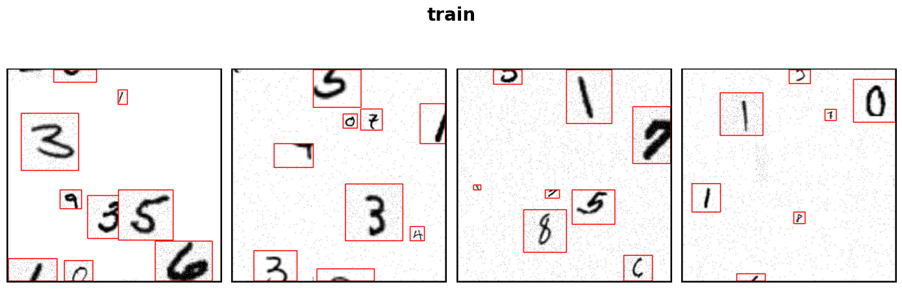
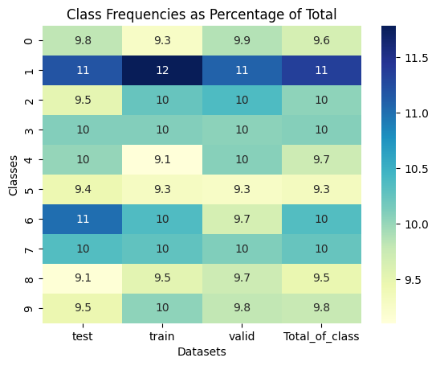
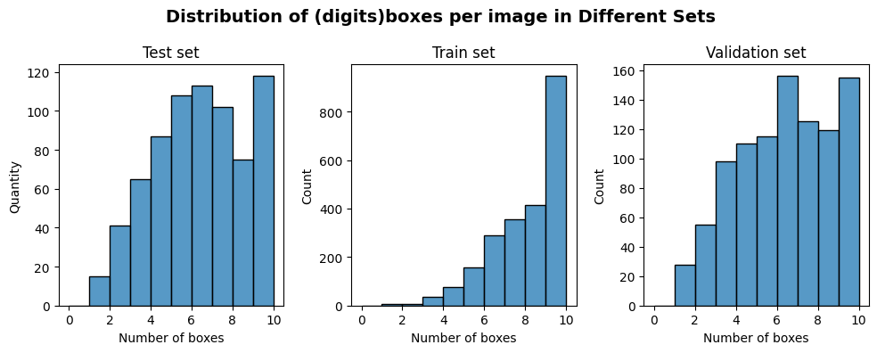
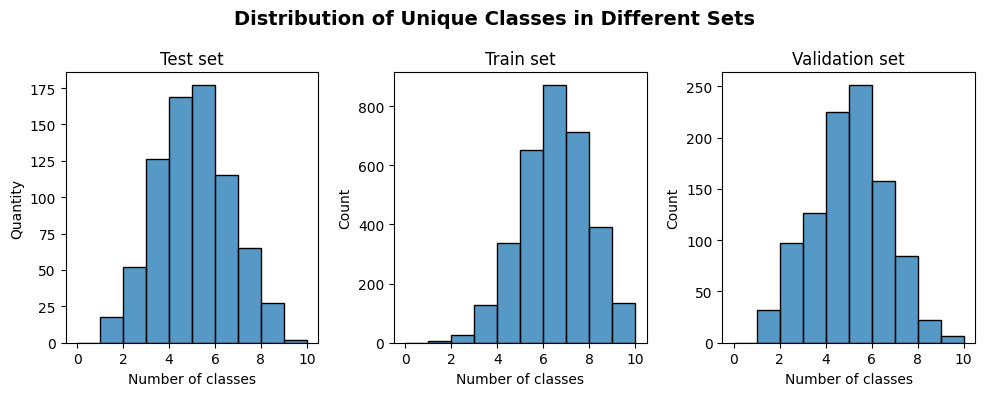

# Datasets creation and model learning

In this project we use YOLOv8 by [ultralytics](https://github.com/ultralytics/ultralytics)

Firstly, we create dataset based on MNIST

The full code of creation is [here](https://github.com/Ceasari/digits_recognition/blob/main/datasets/Dataset_creation.py)

The easiest way to repeat is to use [colab notebook](https://colab.research.google.com/drive/10IZhA6NowPVrabE8AsJqztSU-ly8Pdy4?usp=sharing)

You will be able to create the dataset and train model just in few steps. 


## Example of dataset



## Statistic of dataset



  



## Installation

1. Clone the repository:

    ```
    git clone https://github.com/Ceasari/digits_recognition/
    ```

2. Install the required libraries:

    ```
    pip install -r requirements.txt
    ```

3. To create dataset use `make_dataset.py`

    * DO NOT FORGET TO SET OPTIONS in `datasets/ds_config.py`

4. To train model use `train_validate.py`

    * DO NOT FORGET
        * comment line 25 or 29 depending on the first start or resuming the training
        * the last and best weights will be saved in `runs/detect/train/weights/`

## License

This project is licensed under the MIT License - see the [LICENSE](LICENSE) file for details.
